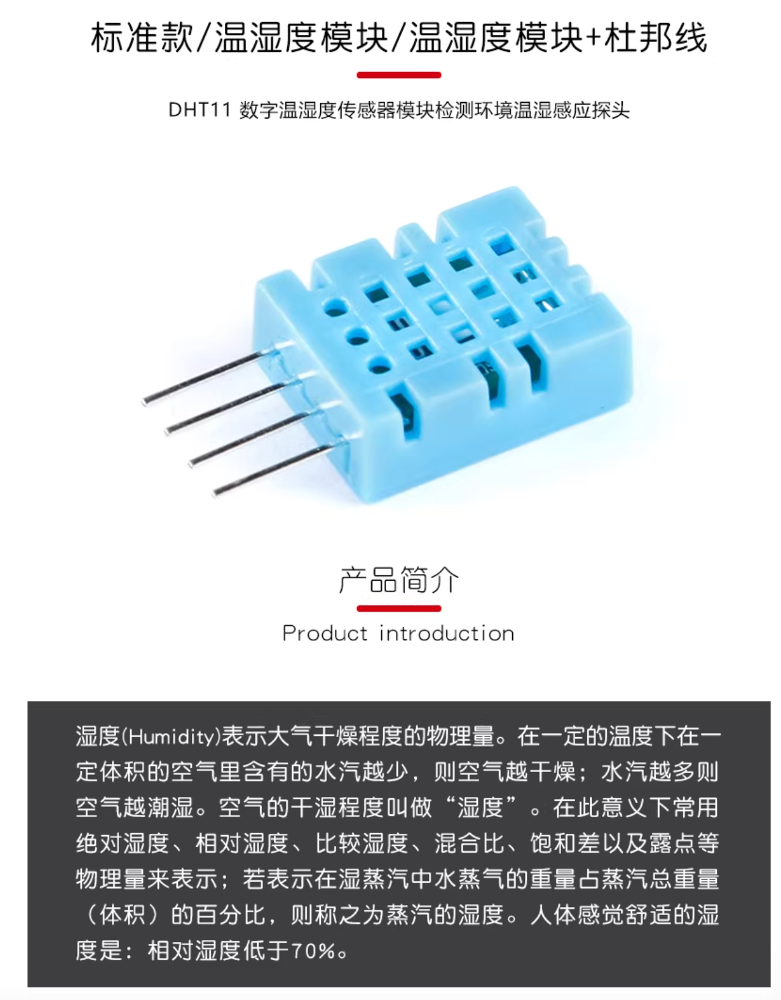
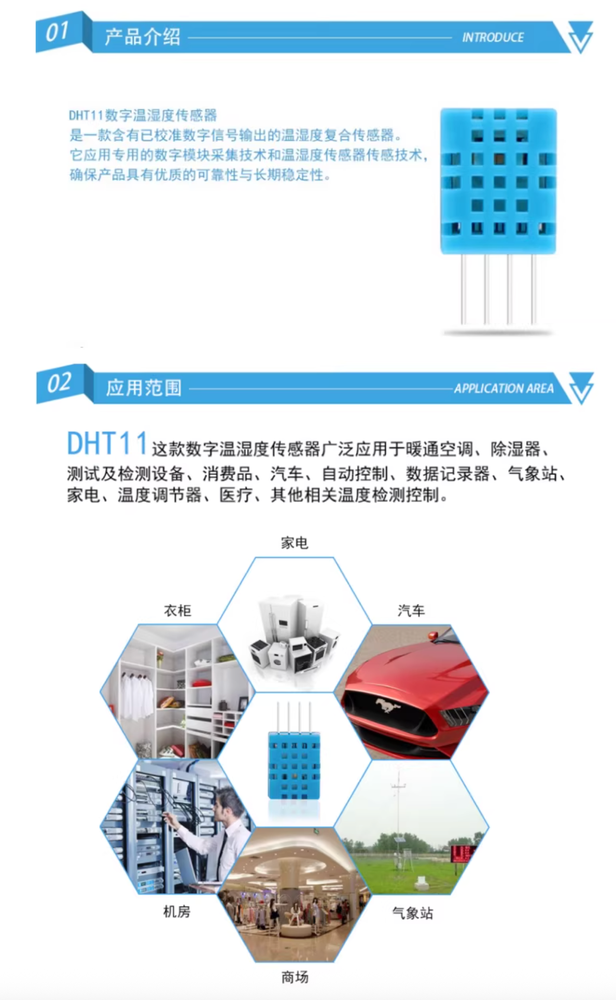
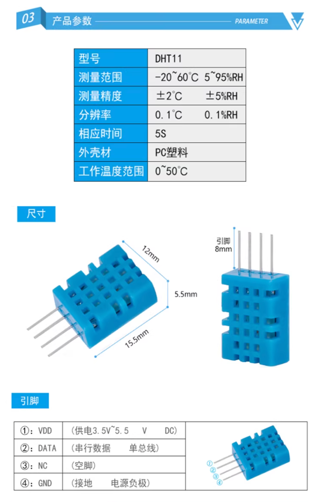
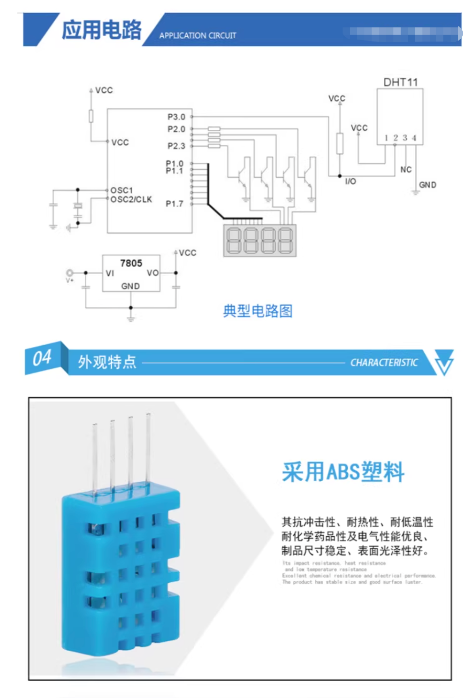
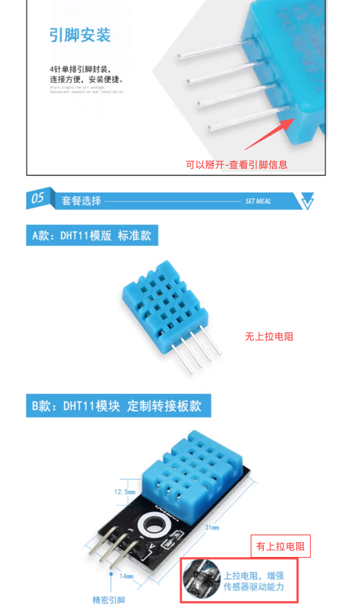

# DHT11 实物图片






## 1. 上拉电阻正确接法：
```
DHT11
  │
  ├── NC (不接线)
  ├── VCC → 3.3V（或5V）
  ├── GND → GND
  └── DATA ─┬──→ 单片机 GPIO
            │
           [4.7kΩ]
            │
           3.3V（VCC）
```
注意：两根线都从 DATA 引脚出发——————一根去单片机，一根去上拉电阻。

* 问：
-   上拉电阻的 VCC 和 DHT11 的 VCC 可以共用同一个 3.3V 吗?
* 答：
-   ✅ 完全可以，而且应该共用！


## 2. 上拉电阻错误接法：
```
DHT11
  │
  ├── VCC → 3.3V（或5V）
  ├── GND → GND
  └── DATA ─┬
            │
           [4.7kΩ]
            │
           单片机 GPIO
```
说明：
这是 串联电阻，不是上拉电阻。
会导致：
    - 电平畸变
    - 时序错误
    - 通信失败

## 3. 上拉电阻多大合适？
经验法则：
    - 3.3V / 5V MCU ──→ 4.7kΩ 最稳
    - 线长 >20cm ──→ 4.7kΩ 或更小

## 4. 上拉电阻作用

### 4.1 上拉电阻的三个核心作用

#### ✅ 作用一：保证空闲状态是高电平

DHT11 总线在空闲时应为 **高电平**

```
无通信 → DATA = 1
```

上拉电阻确保：

* 没人拉低时，DATA 自动回到 VCC

---

#### ✅ 作用二：让 MCU 能区分「0 / 1」

DHT11 用 **脉宽** 表示数据位：

| 信号 | 表现   |
| -- | ---- |
| 0  | 短高电平 |
| 1  | 长高电平 |

如果没有上拉：

* 高电平上不去
* 脉宽测量直接失效

---

#### ✅ 作用三：保护器件（限流）

当：

* MCU 拉低
* DHT11 拉低
* 另一端是 VCC

上拉电阻可以：

* 限制电流
* 防止 IO 直接短接 VCC


